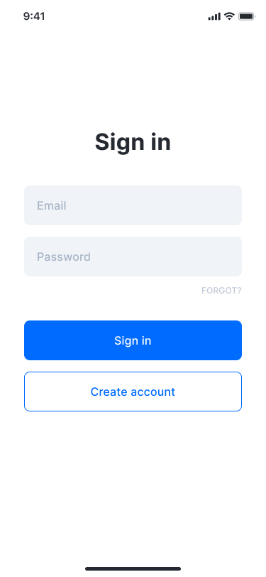

If you're familiar with CSS-in-JS you should be able to fall right into styling in React Native as it follows the same principles. If not, no worries.

React Native has just about all the CSS properties you would expect. The only difference is that rather than using dashes (-) it uses camel case. For example:

`background-color` becomes `backgroundColor`.

So what does this look like in practice? Let's look at an inline style:

```jsx
const App = () => (
  <View style={{ backgroundColor: "red", width: 100, height: 100 }} />
);
```

This works perfectly well but more often than not you'll see the React Native `StyleSheet` API used to encapsulate styles, like so:

```jsx
import { StyleSheet } from "react-native";

const styles = StyleSheet.create({
  box: { backgroundColor: "red", width: 100, height: 100 },
});

const App = () => <View style={styles.box} />;
```

This creates a reference to your style rather than a defined object leading to potentially better performance as you reuse styles.

One interesting thing with styles is how you override them.

Much like css where you can "stack" styles and they'll override each other, you can do the same in React Native by passing an array to the `style` prop. The last items in the array will override properties defined previously.

```js
import { StyleSheet } from "react-native";

const styles = StyleSheet.create({
  box: { backgroundColor: "red", width: 100, height: 100 },
  boxBlue: { backgroundColor: "blue" },
});

const App = () => <View style={[styles.box, styles.boxBlue]} />;
```

First, styles are simply objects (as you may have seen in previous lessons). This

What about layout?

React Native uses Flexbox for laying out content.

This is a whole topic in itself and I've found it's something that you just master over time. A few properties that I constantly use:

1. `flex`
2. `justifyContent`
3. `alignItems`
4. `flexDirection`

The "Layout with Flexbox" goes into details on these - use that page for reference as you go through the exercise.

## 🧑‍💻 Exercise 1

Create 3 squares that are vertically and horizontally centered. Each square should have a unique background color but all shared styles should only be defined once.

## 🧑‍💻 Exercise 2

Use All we learned from Basic components and styling chapters and implement the following Screen: [Figma File ](https://www.figma.com/file/bu3I2wAKP3s59tMO3Z2JWk/Tasker?node-id=20510%3A681)



> Make sure to create a `screens` folder inside `src` and create your screen under `Login` screen.

## Helpful Links

- [StyleSheet API Documentation](https://reactnative.dev/docs/stylesheet)
- [Layout with Flexbox](https://reactnative.dev/docs/flexbox)
